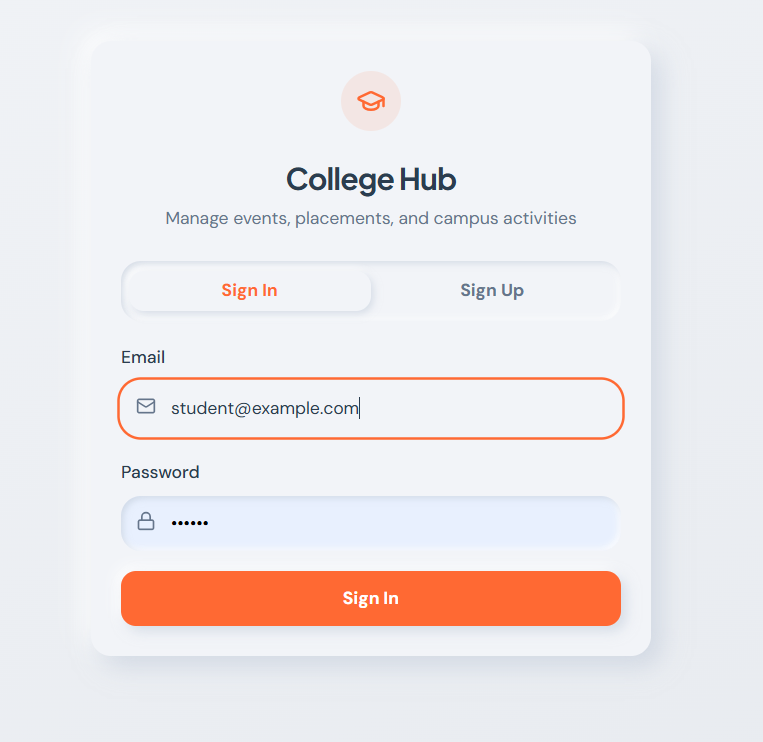
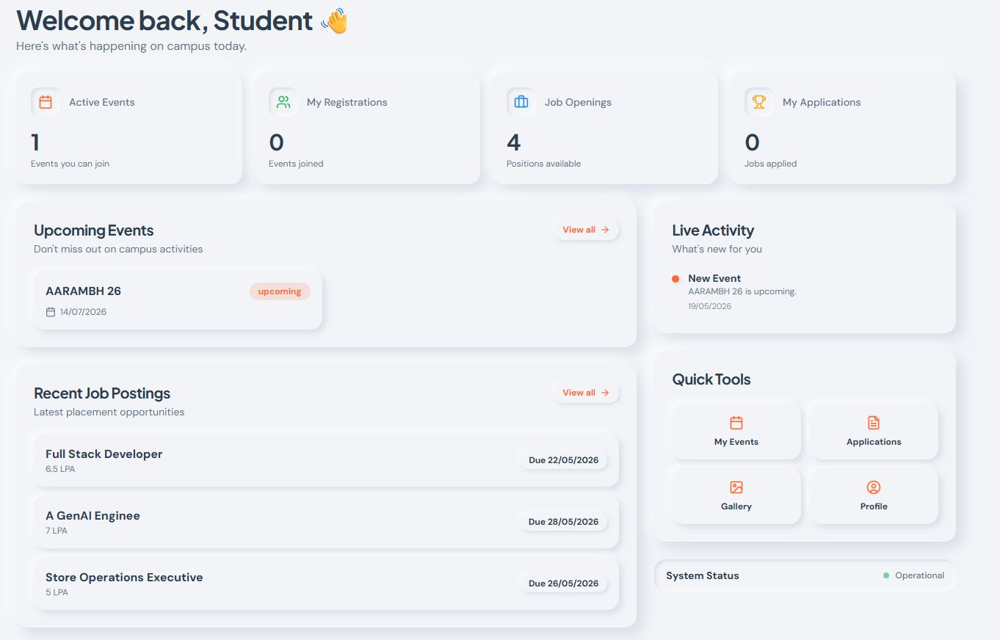

# 🏫 CampusHub

> A full-stack college event and placement management platform that centralizes student activities, event administration and campus placement workflows.

## 🌐 Live Demo

🚀 **[Open CampusHub](https://campus-hub-theta.vercel.app/)**

---

## 📌 Overview

CampusHub is a centralized web application designed to streamline college event management and placement operations.

It provides separate workflows for students, event administrators, placement administrators and super administrators, allowing different roles to manage their respective activities through dedicated dashboards.

---

## ✨ Key Features

### 👨‍🎓 Student Portal

- 🔐 User authentication
- 📊 Student dashboard
- 🎟️ Browse and view college events
- 📝 Event registration
- 📅 My Events
- 💼 Browse placement opportunities
- 📄 Apply for placement opportunities
- 📋 Track applications
- 👤 Student profile

### 🎪 Event Administration

- 📊 Event admin dashboard
- 🎯 Event management
- 📌 Sub-event / activity management
- 👥 Registration management
- 🏆 Results management
- 🖼️ Event gallery management
- 📅 Manage assigned events

### 💼 Placement Administration

- 📊 Placement dashboard
- 🏢 Company management
- 💼 Job posting management
- 👥 Student application management
- 🔎 Search and filter applications
- 📋 Review application details
- 🔄 Application status management
- 📈 Placement statistics
- 🏆 Placement results

### 🛡️ Super Administration

- 👥 Coordinator management
- 📊 Administrative dashboard
- 🔐 Role-based administrative workflows

---

## 🔄 Application Workflow

```text
Student
   │
   ▼
Browse Job
   │
   ▼
Apply
   │
   ▼
Pending
   │
   ├──► Shortlisted
   │
   ├──► Rejected
   │
   └──► Selected

   ```

---
## 🖥️ Screenshots

### 🔐 Login & Authentication



### 📊 Student Dashboard




---
## 🛠️ Tech Stack

| Category | Technology |
|---|---|
| Frontend | React.js |
| Language | TypeScript |
| Styling | Tailwind CSS |
| UI Components | shadcn/ui |
| Backend | Supabase |
| Database | PostgreSQL |
| Authentication | Supabase Auth |
| Storage | Supabase Storage |
| Data Fetching | React Query |
| Routing | React Router |
| Deployment | Vercel |

---

## 🏗️ Application Architecture

```text
                    CampusHub
                        │
        ┌───────────────┼────────────────┐
        │               │                │
        ▼               ▼                ▼
    Students       Event Admin      Placement Admin
        │               │                │
        └───────────────┼────────────────┘
                        │
                        ▼
                  Supabase
                        │
             ┌──────────┼──────────┐
             ▼          ▼          ▼
         PostgreSQL    Auth      Storage
```

---

## 📂 Project Structure

```text
CampusHub/
│
├── public/
├── src/
│   ├── components/
│   ├── contexts/
│   ├── hooks/
│   ├── integrations/
│   │   └── supabase/
│   ├── lib/
│   ├── pages/
│   │   ├── event-admin/
│   │   ├── placement-admin/
│   │   ├── super-admin/
│   │   ├── Auth.tsx
│   │   ├── Dashboard.tsx
│   │   ├── Events.tsx
│   │   ├── Placements.tsx
│   │   ├── MyEvents.tsx
│   │   ├── MyApplications.tsx
│   │   └── Profile.tsx
│   └── types/
│
├── supabase/
├── package.json
└── README.md
```

---

## 🚀 Getting Started

### Prerequisites

- Node.js
- npm
- Supabase project

### Installation

```bash
git clone https://github.com/ishaansaraswat-lang/CampusHub.git
cd CampusHub
npm install
```

### Environment Variables

Create a `.env` file:

```env
VITE_SUPABASE_URL=your_supabase_url
VITE_SUPABASE_ANON_KEY=your_supabase_anon_key
```

### Run Locally

```bash
npm run dev
```

---

## 🔒 Security

CampusHub uses Supabase authentication and database-level access controls to manage application data and user access.

Never commit private credentials or `.env` files to the repository.

---

## 📈 Future Improvements

- 📧 Automated email notifications
- 🔔 Real-time notifications
- 📱 Mobile application
- 📊 Advanced analytics
- 🎫 QR-based event attendance
- 📄 Automated placement reports
- 🔎 Advanced search and filtering

---

## 👨‍💻 Author

**Ishaan Saraswat**

Full-Stack Developer  
React.js • TypeScript • Supabase • PostgreSQL

[](https://www.linkedin.com/in/ishaan-saraswat-tech/)

[](https://github.com/ishaansaraswat-lang)
